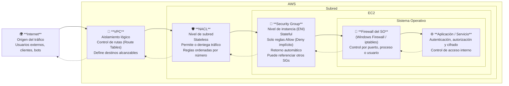

# Si ome si

```mermaid
flowchart LR
  A["🌍 **Internet**<br>Origen del tráfico<br>Usuarios externos, clientes, bots"]
  subgraph AWS
    B["🧭 **VPC**<br>Aislamiento lógico<br>Control de rutas (Route Tables)<br>Define destinos alcanzables"]
    subgraph Subred
      C["🛡️ **NACL**<br>Nivel de subred<br>Stateless<br>Permite o deniega tráfico<br>Reglas ordenadas por número"]
      subgraph EC2
        D["🔐 **Security Group**<br>Nivel de instancia (ENI)<br>Stateful<br>Solo reglas Allow (Deny implícito)<br>Retorno automático<br>Puede referenciar otros SGs"]
        subgraph Sistema Operativo
          E["🧱 **Firewall del SO**<br>(Windows Firewall / iptables)<br>Control por puerto, proceso o usuario"]
          F["⚙️ **Aplicación / Servicio**<br>Autenticación, autorización y cifrado<br>Control de acceso interno"]
        end
      end
    end
  end

  A ---> B
  B ---> C
  C ---> D
  D ---> E
  E ---> F

  F -.-> E
  E -.-> D
  D -.-> C
  C -.-> B
  B -.-> A
```

guyk
